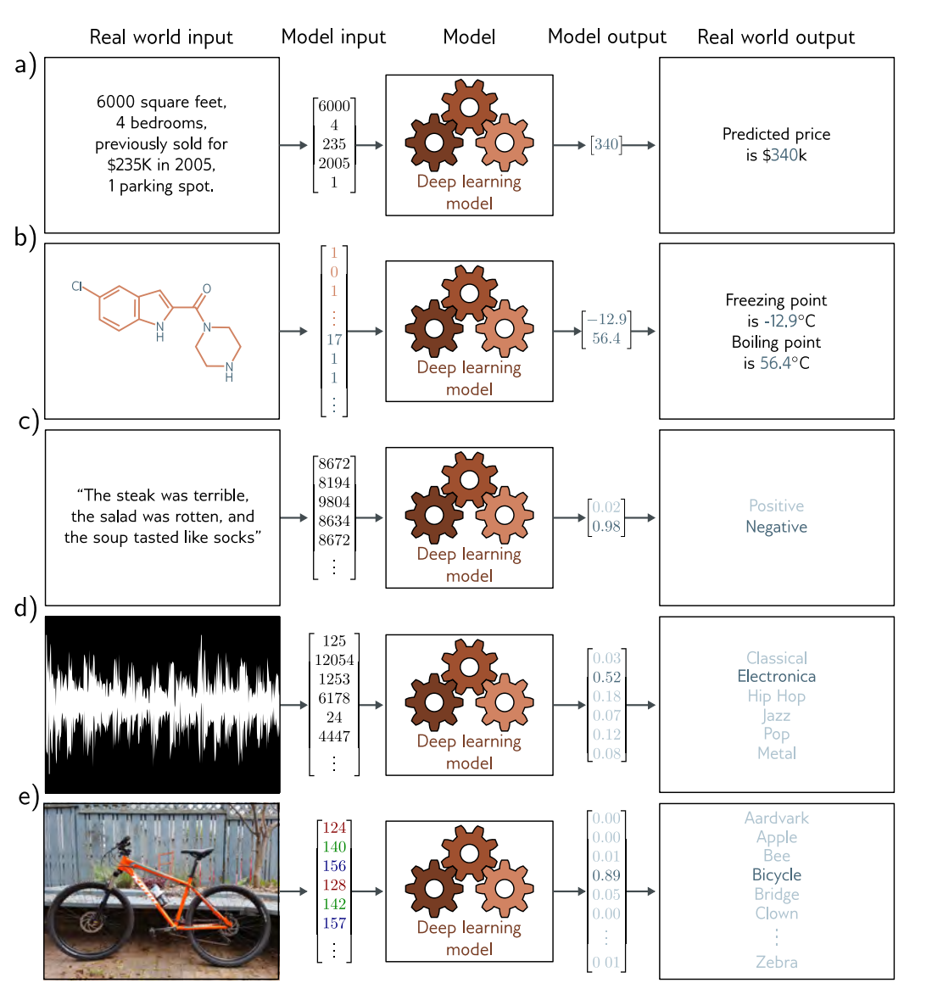
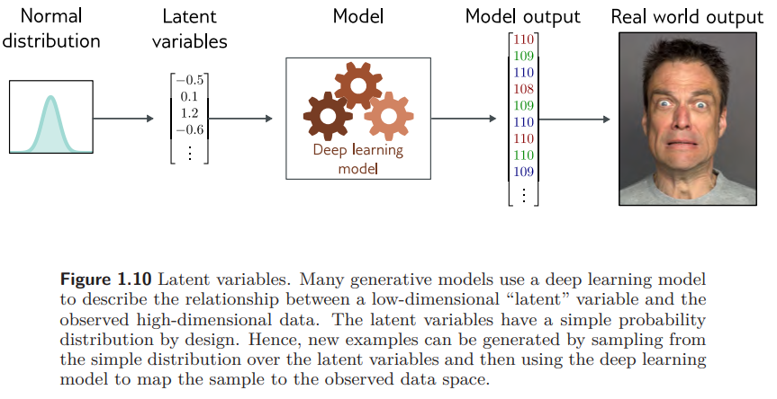
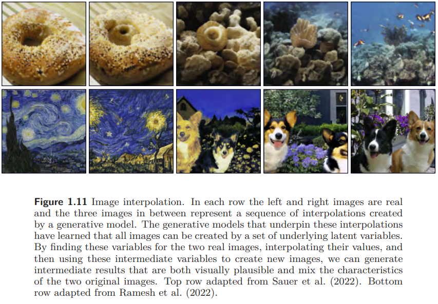

Machine Learning is a subset of AI that learns to make decisions by fitting mathematical model to observed data. This area is almost synonymous with the term AI. 

Machine Learning can be divided into three areas:
- supervised learning
- unsupervised learning
- reinforcement learning  

Deep neural networks are a useful type of machine learning model, which can process inputs that are very large, of variable length and contain various kinds of internal structures and can output different types

## 1.1 Supervised Learning (chapters 2-13)

Supervised learning **model** define a mapping from **input** data to an **output** prediction. 
* map: a correspondence, a connection
* model: requires lots of labeled input/output pairs
* input and output: various, structured, high-dimensional

### 1.1.1 Regression and Classification Problems
Difference: The return of regression is continuous but classification's return is discontinuous. 

a) regression
b) multivariate regression (output is more than one)
c) binary classification 
d) and e) multiclass classification (output is a vector containing probabilities)

### 1.1.2 Inputs
 The input varies differently in different situation.
 a) tabular vector (require the same output while change the order)
 b) both structure and constituent atoms
 c) variable length and important order
 d) and e) large, high-dimensional
 

### 1.1.3 Outputs

![[Pasted image 20240126163516.png]]
a) and b) high dimensional and structured
c) - e) more difficult: genuinely ambiguous, considerably structured

## 1.2 Unsupervised learning (chapters 14-18)
Constructing a model from input data without corresponding output labels is termed unsupervised learning. Its goal is to describe or understand the structure of the data.

### 1.2.1 Generative model
Learn to synthesize new data examples that are statistically indistinguishable from the training data.
Generative models can generate images and text, inpaint image and complete text. It appears intelligent but only knows about the statistics of language and **does not** understand the significance of its answers.

### 1.2.2 Latent variables
In general, datasets of images, music and text can be described by a relatively small number of underlying variables that are called **latent variables**. Because there are basic rules of nature, the real world is a tiny subset of random composition.

## 1.3 Reinforcement learning (chapter 19)
Taking an action can produce rewards, and the goal of reinforcement learning is for the agent to learn to choose actions that lead to high rewards on average.
One complication is that the reward may be not straightforward (aka temporal credit assignment problem). Whether follow this strategy or try different actions to see if it can improve is also a problem (aka exploration-exploitation)

## 1.4 Ethics (chapters 20-21)
1. **Bias and fairness:** we train a system based on historical data, which may reproduce historical biases
2. **Explainability:** the decision-making system are not transparent, we can't fully understand the model
3. **Weaponizing AI** 
4. **Concentrating power:** deep learning is likely to concentrate power in the hands of the few organizations that control it
5. **Existential risk:** it may out of human's control and even understand its motives

